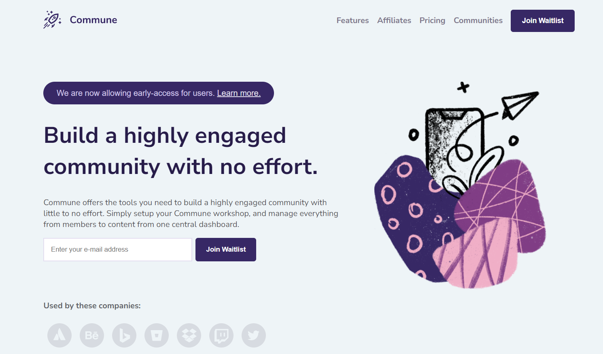

# Waitlist Landing Page 👋

This is a Codewell's project.
I designed the project to be responsive on mobile, desktop and tablets
In addition to the project I added some javascript to allow the mobile menu to open up through the hamburger svg. I also added a hover state to two buttons 

### Screenshot

### Built With
- HTML
- CSS
- Javascript
- Flexbox

